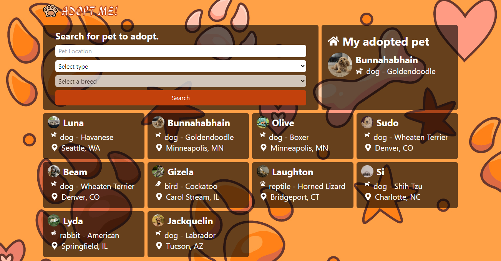
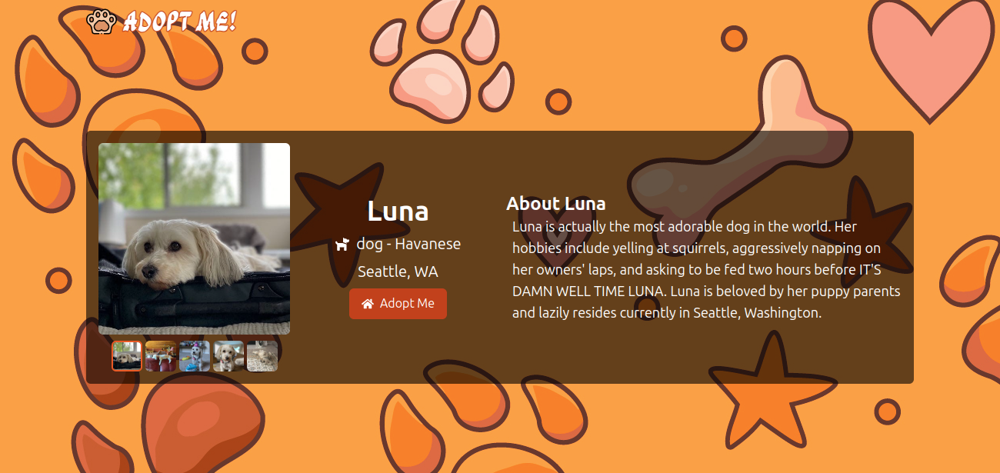

# MaghhPlayer

**Project Overview**

**Adopt Me** is a responsive web application built with ReactJS, utilizing Redux Toolkit for state management and RTK Query for efficient data fetching. This project allows users to search for pets by type, breed, and location, view detailed pet information, and initiate the adoption process. Designed with a user-friendly interface, Adopt Me makes it easy for potential pet owners to find their perfect match.

## Features

- **Search Pets:** Search by type, breed, and location to find pets available for adoption.
- **Pet Details:** View comprehensive information about each pet, including age, breed, and location.
- **Adopt Pet:** Begin the adoption process directly through the platform.
- **Responsive Design:** Optimized for mobile, tablet, and desktop to ensure a seamless experience on any device.


## Tech Stack

- **ReactJS (VITE):** JavaScript library for building user interfaces.
- **React Router:** For efficient routing and navigation.
- **Redux Toolkit & RTK Query:** Powerful state management and data-fetching tools.
- **TailwindCSS:** Utility-first CSS framework for styling.

## Screenshots





## Demo

You can view a live demo of the project [here](https://adoptme-rouge.vercel.app/).


## Installation

1. Clone the repository:

```bash
  git clone https://github.com/maghrabyy/adopt-me.git
```
2. Navigate to the project directory:

```bash
cd adopt-me
```
3. Install the dependencies:

```bash
npm install
```
 
 4. Start the development server:

 ```bash
 npm run dev
 ```

 


## Project Structure

The project is organized for easy development and maintenance:

- **/src**
  - **/APIs:** Contains API configurations and requests for pet data.
  - **/Context:** Context API setup for state sharing across components.
  - **/Pages:** Different pages for routing and displaying content.
  - **/Store:** Redux store setup with RTK Query integration.
  - **/assets:** Contains images and static files.
  - **/components:** Reusable components for the UI.
  - **/utils:** Helper functions and utilities.
## 🚀 About Me

Hello! I’m **Mahmoud Elmaghraby**, a frontend developer with expertise in ReactJS and Material UI. I enjoy creating clean, responsive, and engaging user interfaces, especially for corporate applications. Feel free to connect with me or check out my other work!

- GitHub: [maghrabyy](https://github.com/maghrabyy)
- LinkedIn: [Mahmoud Elmaghraby](https://linkedin.com/in/maghrabyy)


## Contributing

Contributions are welcome! Feel free to submit issues or pull requests to improve the functionality or add new features.


## License
This project is licensed under the [MIT](https://choosealicense.com/licenses/mit/) License.

